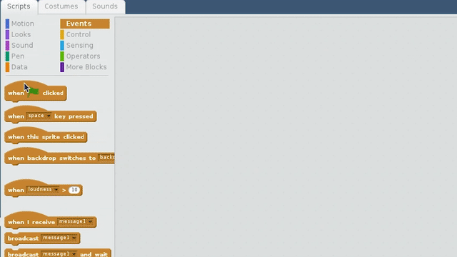

To detect motion with a passive infrared sensor (PIR) in Scratch 2, you simply need to determine if the GPIO pin to which the PIR attached is `high` or `low`. If the pin is `high`, then motion has been detected. If the pin is `low`, then there is no motion.

- For a simple test you can use the following script.

Wait about a minute for your PIR to settle, and then run the script. When it detects motion, your sprite should say `True`, and when no motion is detected, it will say `False`.

